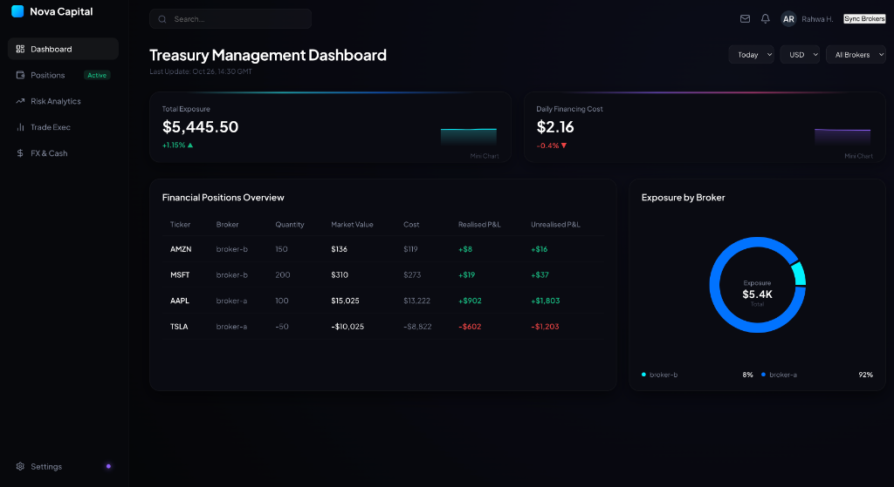

# FinStream

# Prime Broker Data Aggregator & Treasury Management Dashboard

FinStream is a fintech backend application designed to ingest, normalize, store, and visualize portfolio position data from multiple simulated prime brokers.

The project demonstrates production-style backend engineering practices including:

- REST API development with FastAPI
- ETL pipeline design
- Data normalization
- AWS cloud architecture
- Database abstraction
- Layered backend architecture
- Testing strategies
- Error handling and logging

The goal of FinStream is to simulate how financial institutions consolidate fragmented portfolio data from different broker systems into one standardized platform.

---

# 🚦 Project Status

Current implementation:

✅ Multi-broker ingestion pipeline
✅ Broker registry pattern
✅ Data normalization layer
✅ S3 raw data archival
✅ DynamoDB persistence
✅ FastAPI REST API
✅ React dashboard
✅ AWS Lambda deployment architecture
✅ Layered backend architecture

In progress:

🚧 Automated test coverage with Pytest
🚧 EventBridge scheduled ETL execution
🚧 Terraform infrastructure provisioning

---

# 📸 Application Preview

## Dashboard



FinStream provides a dashboard view of consolidated portfolio positions across multiple simulated prime brokers.

Features demonstrated:

- Portfolio exposure overview
- Normalized broker positions
- ETL synchronization workflow
- Cloud-hosted backend architecture

---

# 🏗️ Architecture Overview

FinStream follows a layered architecture based on separation of concerns.

```text
                         React Dashboard
                               |
                               |
                               v
                         FastAPI Routes
                               |
                               |
                               v
                         Service Layer
                    (Business Logic + ETL)
                               |
          -----------------------------------------
          |                    |                  |
          v                    v                  v
   Broker Registry        Mappers          Repositories
          |                    |                  |
          v                    v                  v
   Broker Clients       Position Schema      DynamoDB
          |
          v
 External Broker APIs

Raw Payload Archive
          |
          v
         S3
```


Each layer has a clear responsibility:

| Layer | Responsibility |
|---|---|
| Routes | Handle HTTP requests and responses |
| Services | Business logic and ETL workflows |
| Repositories | Database persistence and retrieval |
| Clients | Fetch external broker data |
| Mappers | Transform different broker formats |
| Schemas | Validate application data models |

---

# 🚀 Project Features

## Multi-Broker Data Ingestion

FinStream integrates with multiple simulated prime brokers.

Currently supported:

- Broker A
- Broker B

Each broker provides different data structures, which are normalized into a common format.

---

## Data Normalization

Different brokers expose different schemas.

Example:

### Broker A
```json
{
  "symbol": "AAPL",
  "qty": 100,
  "price": 200
}
```

### Broker B
```json
{
  "ticker": "AAPL",
  "amount": 100,
  "market_value": 20000
}
```

Both are transformed into:

```python
Position(
     broker="broker-a",
     ticker="AAPL",
     quantity=100,
     market_value=20000,
)
```

This allows the rest of the application to work with a consistent data model.

## 🔄 ETL Pipeline

The ETL workflow follows these steps:

```text
Broker APIs
     |
     v
Fetch Raw Data
     |
     v
Archive Raw Payloads (S3)
     |
     v
Load Raw Data
     |
     v
Normalize Broker Data
     |
     v
Validate Normalized Data
     |
     v
Persist Positions (DynamoDB)
```

### ETL Reliability & Sync Abort Guard

The ETL pipeline is designed to be highly resilient against network exceptions, schema differences, and persistence errors.

Before modifying the database:
* **Fail-Safe Ingestion:** Individual broker fetches are isolated inside `try-except` blocks. If any broker fails to respond, the pipeline logs the failure in a `failed_brokers` dictionary.
* **Sync Abort Guard (No Data Loss):** If any broker fails to fetch, the sync **aborts immediately** before executing `delete_all_positions_repo()`. This prevents a partial database sync and protects historic data integrity.
* **Granular Normalization Isolation:** Data normalization runs in separate scopes per broker. If normalization fails for one broker, the pipeline logs a detailed warning traceback and continues with the others.
* **Type-Safe API Contracts:** All error and abort response dictionaries are structured to return `"positions_added": 0` and error descriptions to comply with FastAPI schema validation.

## 🔌 Broker Registry Pattern

Instead of hardcoding every broker:

```python
BROKER_REGISTRY = {
    BrokerName.BROKER_A: get_broker_a_data,
    BrokerName.BROKER_B: get_broker_b_data,
}
```

The registry pattern avoids modifying the core ETL pipeline when new integrations are introduced.

The ETL engine depends on abstractions:

Broker Fetcher → Raw Payload → Mapper → Position Schema

rather than broker-specific implementations.

Adding a new broker only requires registration:

```python
BROKER_REGISTRY[BrokerName.BROKER_C] = get_broker_c_data
```

No changes are required in the core ETL workflow. Adding a new broker only requires registering the fetcher and providing the required normalization logic.

Benefits:

Easier scaling
Less duplicated code
Follows Open/Closed Principle
## 🧩 Backend Architecture

### Routes Layer

Routes are responsible only for API communication.

Example:

```text
GET /api/positions
GET /api/positions/{broker}
GET /api/positions/{broker}/{ticker}
```

Routes do not contain:

Database queries
ETL logic
Business rules
### Service Layer

The service layer contains application logic.

Responsibilities:

Coordinate ETL execution
Fetch broker data
Apply business rules
Validate workflows
Handle errors
Manage logging

Example:

```text
Route
     |
     v
Service
     |
     v
Repository
     |
     v
Database
```
### Repository Layer

Repositories isolate database operations.

Responsibilities:

DynamoDB scans
DynamoDB queries
DynamoDB writes
Database retrieval

Repositories are responsible only for persistence operations. They hide DynamoDB-specific implementation details from the service layer.

Example:

```text
Service
     |
     v
Repository
     |
     v
DynamoDB
```

This makes it easier to replace DynamoDB with another database in the future.

## Why DynamoDB?

DynamoDB was selected because the application's access patterns are predictable:

- Retrieve all positions
- Retrieve positions by broker
- Retrieve one position by broker and ticker

The table design:

PK: broker

SK: ticker

allows efficient:

- Query operations by broker
- GetItem operations using broker + ticker
- Serverless scaling without managing infrastructure

For a highly relational financial system, a relational database could also be suitable. DynamoDB was chosen here to explore cloud-native serverless architecture.

## 📚 API Documentation

FastAPI automatically generates interactive API documentation.

Available locally:

Swagger UI:

http://localhost:8000/docs

ReDoc:

http://localhost:8000/redoc

## API Endpoints

| Method | Endpoint | Description |
|---|---|---|
| GET | `/api/positions` | Retrieve all positions |
| GET | `/api/positions/{broker}` | Retrieve positions for one broker |
| GET | `/api/positions/{broker}/{ticker}` | Retrieve one position |
| POST | `/api/etl-sync` | Trigger data synchronization |

## ☁️ AWS Architecture

### Amazon S3

S3 stores raw broker responses.

Purpose:

Historical archives
Data recovery
Auditing

Example:

s3://finstream-bucket/

archive/

    20260710_120000-broker-a.json

    20260710_120000-broker-b.json
### Amazon DynamoDB

DynamoDB stores normalized portfolio positions.

Table design:

Partition Key
broker
Sort Key
ticker

Example:

broker	ticker	quantity	market_value
broker-a	AAPL	100	20000
broker-a	TSLA	50	12000
broker-b	AAPL	200	40000

This allows efficient queries:

Get all positions
Get positions by broker
Get one position by broker + ticker

## ☁️ Deployment Architecture

Production deployment:

```text
React Application
     |
     v
CloudFront CDN
     |
     v
S3 Static Hosting

API Requests

     |
     v

API Gateway

     |
     v

AWS Lambda

     |
     v

FastAPI Application

     |
     v

DynamoDB
```

## 🖥️ Frontend

Built with:

- React
- TypeScript
- Vite
- Recharts
- Lucide React

Features:

Portfolio dashboard
Exposure visualization
Position tables
ETL synchronization controls

Frontend communicates with FastAPI using REST APIs.

## 🛠️ Technology Stack

### Backend
- Python
- FastAPI
- Pydantic
- Boto3
### Frontend
- React
- TypeScript
- Vite
- Recharts
- Lucide React

### Cloud
* AWS Lambda
* API Gateway
* DynamoDB
* S3
* CloudFront
* EventBridge

### Testing
- Pytest
- Moto
- FastAPI TestClient
## 📂 Project Structure
```text
backend/

├── clients/
│   └── Broker API integrations
│
├── domain/
│   └── Domain entities and enums
│
├── integrations/
│   └── AWS service connections
│
├── mappers/
│   └── Data transformation logic
│
├── repositories/
│   └── Database operations
│
├── routes/
│   └── FastAPI endpoints
│
├── schemas/
│   └── Pydantic models
│
├── services/
│   └── Business logic and ETL workflows
│
├── tests/
│
│   ├── unit/
│   │   └── Mapper tests
│   │
│   └── integration/
│       └── API and repository tests
│
└── main.py

frontend/

├── src/
│   ├── api.ts
│   ├── App.tsx
│   ├── App.css
│   ├── index.css
│   ├── main.tsx
│   └── components/
│       ├── ExposureCharts.tsx
│       ├── MetricCard.tsx
│       └── PositionTable.tsx
│
├── public/
└── vite.config.ts

root/

├── template.yaml
├── samconfig.toml
├── deploy_frontend.sh
└── presentation.md
```

## Key Engineering Decisions

### Layered backend

The API, service, mapper, and repository layers are intentionally separate so broker-specific logic stays isolated from persistence and HTTP concerns.

### Registry-based broker ingestion

Broker fetchers are registered in a central broker registry, which keeps the ETL workflow stable as brokers are added or swapped out.

### Mapper-driven normalization

Raw broker payloads are normalized before persistence, so downstream code only works with the shared `Position` schema.

### Persistence-only repositories

Repositories only read and write DynamoDB items. Business rules stay in services, which keeps the database layer replaceable.

### DynamoDB key design

DynamoDB uses:

Partition Key:
broker

Sort Key:
ticker

This design matches the application's access patterns:

- Retrieve all positions
- Retrieve positions by broker
- Retrieve a specific ticker from a broker

Using both keys allows efficient single-item retrieval with GetItem operations.

### Lambda-ready backend entrypoint

The app is packaged with a Lambda handler, so the same FastAPI application can run locally or behind AWS infrastructure.

### S3 archival before persistence

Raw broker payloads are archived to S3 before normalized positions are saved to DynamoDB, which gives you traceability for debugging and audits.

### Fault Handling Strategy

Broker failures are isolated during ingestion. Failed broker fetches are logged, preventing silent failures and making troubleshooting easier.

Future improvements include retry strategies, circuit breakers, and alerting.

## 🧪 Testing Strategy

### Unit Tests

Focus on pure business logic:

- Broker normalization
- Position mapping
- Registry behaviour
- Edge cases

Examples:

- Missing fields
- Empty broker responses
- Invalid numeric values
- Unexpected payload formats

### Repository Tests

Repositories are tested separately using AWS mocks.

Tools:

- Moto
- Pytest fixtures

Tests validate:

- DynamoDB writes
- Queries
- Item retrieval
- Pagination behaviour

### API Integration Tests

Using FastAPI `TestClient`.

Testing:

- HTTP status codes
- Response schemas
- Validation errors
- Exception handling
## 📝 Logging & Error Handling
The application uses Python logging instead of print statements.

Example:
```python
logger.info("Starting ETL process")
logger.warning("Broker returned empty data")
logger.exception("Failed to fetch broker data")
```

Logging provides:
* Better debugging
* Production monitoring
* CloudWatch integration

## 💻 Running Locally

### Backend

Clone repository:

git clone <repository-url>

Navigate:

cd backend

Create environment:

python -m venv .venv

Activate:

Mac/Linux:

source .venv/bin/activate

Install dependencies:
```bash
# If using uv (recommended):
uv sync

# If using pip:
pip install -e .
```

Run FastAPI:

uvicorn main:app --reload

Backend:

http://localhost:8000
### Frontend

Navigate:

cd ..

cd frontend

Install:

npm install

Run:

npm run dev

Frontend:

http://localhost:5173
## 🚀 Future Improvements

### Event Driven ETL

Replace manual ETL triggering with:

EventBridge

      |

Lambda

      |

ETL Pipeline

### Infrastructure as Code

Add:

Terraform
Automated AWS deployment
Environment management
### Monitoring
Add:
* CloudWatch dashboards
* Alerts
* Metrics tracking

### Security & Auth

Future improvements:
- Authentication
- Authorization
- API throttling
- IAM policy hardening

## Engineering Principles Applied

### Separation of Concerns

Each component has one responsibility.

### Scalability
Registry-based design allows adding new brokers easily.

### Maintainability
Clear boundaries between API, business logic, and persistence.

### Fault Tolerance
Broker failures are isolated and logged.

### Testability
Business logic and database operations can be tested independently.

## Author
Built as a personal fintech engineering project to develop production-style backend skills with Python, FastAPI, AWS, and cloud-native architecture.